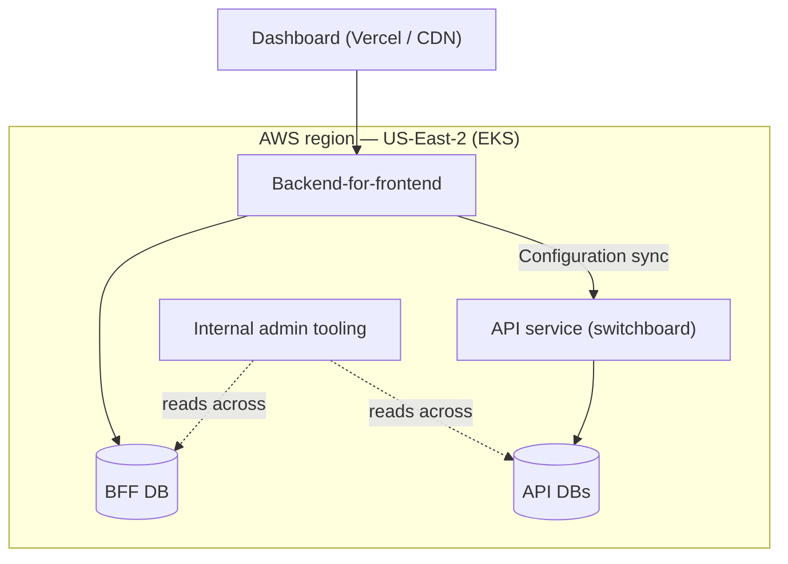

# DevOps Systems Design Exercise

Today Knock runs as a single-site service inside one AWS region (US-East-2). We want to stand up a **dedicated EU-resident site** so that we can offer EU customers **data residency**. This is a discussion exercise — there's no single right answer. We want to reason through the exercise and its trade-offs together.

## How We Run Today

At a high level, here's roughly how Knock runs today. It's deliberately simplified, but close enough to reason about:

- **Dashboard** — our static frontend, hosted on **Vercel**. It's a CDN of static assets: cloud-agnostic, the same everywhere in the world, and holds no residency-protected data itself.
- **Backend-for-frontend (BFF)** — the control-plane API that the dashboard talks to, with its own database.
- **API service** — the primary request-processing layer, backed by several databases.
- **Internal admin tooling** — operational tooling that today can read across the whole estate.

A few platform facts worth knowing:

- Everything runs in a **single AWS region (US-East-2)**, on **EKS**.
- **Terraform** manages almost all of our infrastructure. It doesn't know about the Vercel-hosted dashboard.
- **GitHub Actions** drives our deployments.
- We lean on **AWS managed services plus some vendors** — for example MongoDB Atlas and Clickhouse.

## The Exercise

**How would you plan standing up a new EU site? The key constraint is data residency.**

For the purposes of this exercise, we are talking about running in a single EU region, and not supporting multi-region failover (e.g. active-active across Frankfurt and Dublin). Knock accounts already in the US site would not move to this new region. New customers signing up for Knock could choose which site will host their account.

## Success Criteria

1. A functional **EU-resident Knock site** with **no dependency on US-East-2**.
2. **Maintainable** as we iterate on both the US and EU variants of the infra — automated deployments, kept in sync as much as possible — and **legible to Knock engineering as a whole**. You will be sharing the Terraform patterns you use with the whole team, as they will need to extend whatever you propose in the future.
3. A clear **day-two operations** story: observability, admin tooling, disaster recovery, and compliance controls & audits.

## Out of Scope

- Multi-region **failover / active-active** distribution.
- Product-level decisions about which *features* are enabled per region (e.g. an AI/agent step that depends on a vendor unavailable in the EU).
- Deep GDPR legal specifics — you don't need to be a compliance expert. However, point out how you will meet the key design constraints of data residency, compliance, and maintainability for you and the rest of the team on day two.

## Diagramming Tools

- [Excalidraw](https://excalidraw.com/) - free to use
- [Figma](https://figma.com) - can send an invite
